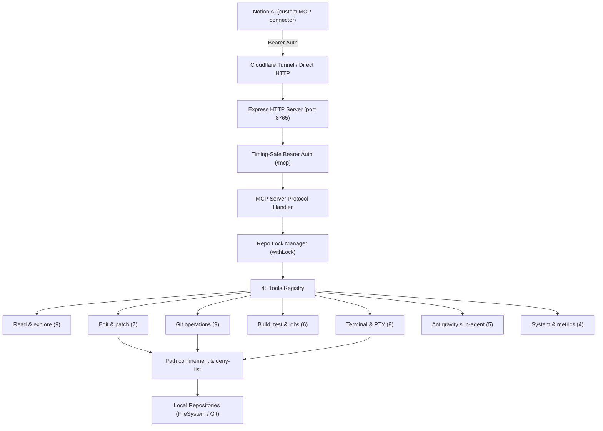

# MCP-LOCAL-NOTION-AI

A local Model Context Protocol (MCP) server that lets Notion AI connect directly to source repositories on your own machine through Notion's custom MCP connector. It provides source-code reading, atomic file editing, build/test execution, Git commits, and interactive Terminal/PTY sessions.

> [!NOTE]
> The server speaks standard MCP over Streamable HTTP, so technically other MCP clients could call it, but this repo is built and tested for Notion AI only. The Antigravity CLI in this repo is a sub-agent spawned by the server, not an inbound client.

> [!IMPORTANT]
> **Docs are verified against the actual source (v0.3.0).**
> The server registers **48 official MCP tools**, with per-repo path confinement, branch protection, atomic file writes, timing-safe Bearer token auth, and execution via Node.js CLI or the Electron desktop app.

---

## 1. System architecture



### Core components
- **Express HTTP server**: Accepts Streamable Transport connections at `/mcp` with timing-safe Bearer token middleware.
- **Tool registry**: Registers and manages 48 MCP tools, filtered by 4 config profiles (`full`, `agent`, `core`, `safe`).
- **Path resolver & security**: Every file path is resolved and verified to stay inside the target repo root. Rejects absolute paths (except the `system` repo), path traversal (`../`), symlink escapes, and deny-listed entries.
- **Repo lock manager**: Per-repo exclusive locks (`withLock`) prevent concurrent write conflicts when several requests arrive at once.
- **PTY session manager**: Long-lived interactive terminal sessions (`node-pty`) with ring buffer, byte cursor, and idle-timeout cleanup.
- **Tree-sitter symbol index**: In-process symbol index (TS/JS/C#/Python/Go/Rust), auto-invalidated by `repoStamp`, warmed in the background at server boot (startup prewarm) and after every `git_commit` — no external indexer needed.
- **Electron desktop app**: Tray GUI to start the MCP server and the Cloudflare tunnel.

---

## 2. Requirements

- **Node.js**: `>= 22.5.0` (needs native `--env-file` and ESM modules per `package.json`).
- **Git**: Installed and on `PATH`.
- **OS**: Windows 10/11, macOS, or Linux.
- **Optional, per project**:
  - `ripgrep` (faster text search).
  - `.NET SDK` / `npm` / `cargo` / `python` (depends on the project toolchain).
  - `cloudflared` (only if you expose a Cloudflare Tunnel to Notion AI).

---

## 3. Install and run

### Option 1: Node.js CLI

```bash
# 1. Install dependencies
npm install

# 2. Create env config from the template
cp .env.example .env
# Edit MCP_TOKEN in .env to a random secure string

# 3. Declare your repo list
cp repos.example.json repos.json

# 4. Typecheck and build
npm run typecheck
npm run build

# 5. Start the server
npm start
# Or dev mode: npm run dev
```

Check server liveness:
```bash
curl http://127.0.0.1:8765/health
```

### Option 2: Electron desktop app

The GUI manages the server, generates random tokens, shows logs, and controls the Cloudflare Tunnel.

```bash
# Launch the desktop UI
npm run gui

# Package a portable Windows build
npm run dist:win
```

---

## 4. Detailed configuration

### 4.1. Repo list (`repos.json`)

When `WORKSPACE_ROOT` is not set in `.env`, the server only serves repos explicitly declared in `repos.json`:

```json
{
  "defaults": {
    "branchPrefix": "agent/"
  },
  "repos": [
    {
      "name": "cv-aut",
      "path": "E:/Projects/CV-AUT",
      "write": true,
      "branchPrefix": "agent/"
    },
    {
      "name": "tool-x",
      "path": "E:/Projects/tool-x",
      "write": true,
      "branchPrefix": "*"
    }
  ]
}
```

#### Per-repo fields:
- `name`: Repo identifier used in the tool `repo` parameter (unique, case-insensitive).
- `path`: Absolute path to the local repository.
- `write`: `true` allows file writes and commits; `false` (default) is read-only.
- `branchPrefix`: Git branch prefix allowed for writes (e.g. `agent/`). Use `"*"` or empty string to allow writes on every branch (including `main`/`master`).
- `build` / `test` / `lint` / `typecheck`: Command arrays in argv form (e.g. `["npm", "run", "build"]`). If omitted, the server infers them from the toolchain (`npm`, `dotnet`, `cargo`, `go`, `python`, `maven`).

### 4.2. Auto-discovered repos (`WORKSPACE_ROOT`)

If `WORKSPACE_ROOT` is set in `.env`, every direct child directory containing a `.git` folder is auto-registered.
- Auto-discovered repos are **read-only** by default.
- Set `AUTO_DISCOVERED_WRITE=true` to allow writes for them.

### 4.3. Whole-machine read (`ALLOW_FULL_READ`)

When `ALLOW_FULL_READ=true`, the server adds a read-only virtual `system` repo. Use `repo: "system"` with an absolute path (`E:/Projects/foo/bar.ts`). No per-folder declaration in `repos.json` needed. **The deny-list still blocks** `.env`, SSH keys, `*.pem`.

When `system` is enabled, read tools fall back to `system` if `repo` is left empty.

### 4.4. Whole-machine full access (`ALLOW_FULL_ACCESS`)

> [!CAUTION]
> **Important safety warning**: Default is `ALLOW_FULL_ACCESS=false` (fail-closed).
> When `ALLOW_FULL_ACCESS=true`, the server creates a virtual repo named `system` with root `__FULL_ACCESS__`. Per `src/security/paths.ts`, this mode **fully bypasses both per-repo path confinement and the deny-list**. The AI can access, read, and edit any file on the whole machine via absolute paths (`C:\...`, `E:\...`), including `.env` files, SSH keys, and certificates. Enable it only on your personal machine when really needed, and never expose a tunnel to the internet while it is on.

---

## 5. MCP tool registry (48 tools)

The server registers exactly **48 MCP tools** in 7 functional groups:

### Group 1: Read & explore source code (9 tools)
| Tool | Description |
| :--- | :--- |
| `list_repos` | List served repos, write permission (`write`), and toolchain. Call first when the repo name is unknown. |
| `read_file` | Read one file by relative path (line pagination, strict UTF-8 check). |
| `read_many_files` | Read 1–50 files in a single call to reduce round-trips. |
| `list_dir` | List directory tree (skips `node_modules`, `bin`, `obj`, `dist`, `.git`). |
| `glob_files` | Find file paths by glob pattern (results cached by `repoStamp`; write tools invalidate immediately). |
| `ripgrep` | Search strings/regex in the codebase (`all_repos: true` searches across repos). |
| `get_feature_context` | Combine glob+grep+read into one call: pass a query, get all related files in one payload (3 `detail` levels: L0 list, L1 outline+match context, L2 full file; cached by git HEAD + fingerprint). |
| `trace_flow` | Trace one symbol's execution flow in one call: definition (with body), callers, callees (`depth: 2` supported). |
| `analyze_feature` | Single call for a feature question: related files + main-symbol call flow (auto-detects the symbol from the query or accepts `symbol`). |

### Group 2: Edit files & apply patches (7 tools)
| Tool | Description |
| :--- | :--- |
| `edit_file` | Replace one text span in one file (`old_str` -> `new_str`), preserving CRLF/LF and BOM. The response includes ~11 lines of `context` around the edit so you can verify without calling `read_file` again. |
| `multi_edit_file` | Replace several non-contiguous spans in one file, atomically (auto-rollback if any block fails). The response includes `context` around the first edit. |
| `apply_patch` | Apply a multi-file unified diff patch (Add, Update, Move, Delete) with dry-run and atomic rollback. |
| `create_file` | Create a brand-new file (refuses to overwrite an existing file). |
| `move_file` | Rename or move a file with `git mv` (keeps history). |
| `remove_file` | Delete a tracked file with `git rm`. |
| `git_restore` | Restore one specific file to `HEAD` (rejects wildcards and directories). |

### Group 3: Build, test & background jobs (6 tools)
| Tool | Description |
| :--- | :--- |
| `run_build` | Run the repo's default build (`npm run build`, `dotnet build`, ...). |
| `run_tests` | Run the repo's default unit tests (`npm test`, `dotnet test`, ...). |
| `run_lint` | Run the default linter (`eslint`, `cargo clippy`, ...). |
| `run_typecheck` | Run type checking (`tsc`, `mypy`, ...). |
| `job_status` | Return the status and logs of a running/finished background job. |
| `kill_job` | Kill a background job's parent process and its whole child tree. |

### Group 4: Git operations (9 tools)
| Tool | Description |
| :--- | :--- |
| `git_status` | Show working-tree status (clean/dirty), staged files, and current branch. |
| `git_branch` | List branches, create a new branch (checks write permission and `branchPrefix`), or switch to an existing branch (no prefix check on switch, but later writes on that branch still go through `assertWritableBranch`). |
| `git_stash` | Stash or restore uncommitted changes. |
| `git_diff` | Show detailed diff vs HEAD or staged. |
| `git_log` | Show recent commit history. |
| `git_blame` | Show per-line edit history of one file. |
| `git_commit` | Create a commit (by default only stages files modified by MCP tools; triggers background re-index unless `reindex: false`). |
| `git_push` | Push the current branch to the remote (requires `ALLOW_PUSH=true`). |
| `gh_pr` | Manage, create, or view GitHub Pull Requests via GitHub CLI (`gh`). |

### Group 5: Interactive terminal & PTY (8 tools)
| Tool | Description |
| :--- | :--- |
| `terminal` | Run one stateless shell command in the repo folder and return the result immediately. |
| `terminal_start` | Open a long-lived interactive PTY/ConPTY session (stateful) for interactive commands. |
| `terminal_write` | Send raw input or control keys (`Ctrl+C`, `Enter`) to a PTY session. |
| `terminal_read` | Read new output from a PTY by increasing byte cursor (no repeated output). |
| `terminal_wait_for` | Wait for a string/regex in PTY output (long-poll within one MCP call). |
| `terminal_resize` | Resize the PTY window. |
| `terminal_close` | Close and terminate a PTY session. |
| `terminal_list` | List active PTY sessions. |

### Group 6: Antigravity sub-agent integration (5 tools)
| Tool | Description |
| :--- | :--- |
| `antigravity_spawn` | Launch a background Antigravity sub-agent via CLI (`agy`) for complex tasks. |
| `antigravity_poll` | Read sub-agent progress, tool-call events, and responses. |
| `antigravity_reply` | Send the next conversation turn into the current sub-agent session. |
| `antigravity_stop` | Stop a sub-agent process. |
| `antigravity_list` | List active sub-agent sessions. |

### Group 7: System & stats (4 tools)
| Tool | Description |
| :--- | :--- |
| `reindex` | Force a rebuild of the in-process tree-sitter symbol index, skipping all caches (the index normally invalidates itself by `repoStamp` — only call this for a manual refresh). |
| `health_check` | Liveness probe: uptime, PID, Node.js version. |
| `readiness_check` | Readiness probe: config validity and repo list. |
| `get_metrics` | Tool-call counts, execution times, and PTY session list. |

---

## 6. Tool profiles (`TOOL_PROFILE`)

The `TOOL_PROFILE` env var in `src/config.ts` limits which tools are exposed to the AI client:

- **`full`** (default): All **48 tools**.
- **`core`**: **31 basic tools** (`CORE_ALLOWED` in `src/tools/index.ts`). Hides advanced patch/file tools (`apply_patch`, `move_file`, `remove_file`), `git_push`, `gh_pr`, `kill_job`, and command-execution terminal tools (`terminal`, `terminal_start`, `terminal_write`, `terminal_read`, `terminal_resize`, `terminal_close`, `terminal_list`), but **keeps `terminal_wait_for`**.
- **`agent`**: **9 integration tools** (`AGENT_ALLOWED`), focused on `list_repos`, `apply_patch`, `run_typecheck`, `run_tests`, `git_status`, `git_diff`, and the sub-agent set.
- **`safe`**: Automatically hides tools marked `destructive: true`, `openWorld: true`, or `git_push`.

---

## 7. Safety & risk controls

1. **Timing-safe token auth**: Every `/mcp` request must carry `Authorization: Bearer <MCP_TOKEN>`. Both sides are SHA-256 hashed before `timingSafeEqual` to remove timing attacks.
2. **Per-repo path confinement**: File paths are resolved (`safeResolve`) and verified inside the target repo root. Absolute paths, traversal (`../`), and symlinks escaping the repo are rejected automatically.
3. **Deny-list**: Blocks reads/writes to `.env` (except templates like `.env.example`), `.git/config`, `.git/hooks/`, SSH keys, private keys (`.pem`, `.key`, `.pfx`), and secret files (`secrets/`). *(Note: bypassed only when `ALLOW_FULL_ACCESS=true`. `ALLOW_FULL_READ` keeps the deny-list.)*.
4. **Git branch guard**: Writes/commits are allowed only on branches starting with the repo's `branchPrefix` (default `agent/`), or on every branch when `branchPrefix` is `""` or `"*"`.
5. **Atomic writes with format preservation**: Strict UTF-8 I/O (`fatal: true`), NUL rejection, temp-file + atomic rename. Preserves line endings (CRLF/LF), BOM, and file mode.
6. **Stale-write guard / optimistic concurrency**: Supports `expected_sha256` or `expected_head_sha` checks before edits/patches. If the file changed concurrently, the command is rejected without leaking content.
7. **Terminal env sanitizing**: When `TERMINAL_INHERIT_SECRETS=false` (default), child terminal processes strip secret env vars (`TOKEN`, `SECRET`, `PASSWORD`, `API_KEY`, `CREDENTIAL`, `MCP_TOKEN`). Set `TERMINAL_INHERIT_SECRETS=true` to pass them through intact.

---

## 8. Environment variables (`.env`)

| Variable | Default | Description |
| :--- | :--- | :--- |
| `MCP_TOKEN` | *(Required)* | Bearer token for `/mcp` endpoint auth. |
| `PORT` | `8765` | HTTP server port. |
| `HOST` | `127.0.0.1` | Bind address. |
| `REPOS_CONFIG` | `repos.json` | Repo-list config file path. |
| `WORKSPACE_ROOT` | *(Unset)* | Parent folder with many repos for auto-discovery. |
| `AUTO_DISCOVERED_WRITE` | `false` | Allow writes for auto-discovered repos. |
| `ALLOW_FULL_READ` | `false` | Enable read-only virtual `system` repo (absolute paths; deny-list still applies). |
| `ALLOW_FULL_ACCESS` | `false` | Enable writable virtual `system` repo, bypassing path confinement & deny-list. |
| `DEFAULT_BRANCH_PREFIX` | `agent/` | Default writable branch prefix (use `*` for all branches). |
| `ALLOW_PUSH` | `false` | Enable/disable the `git_push` tool. |
| `GIT_REMOTE` | `origin` | Default Git remote name. |
| `ALLOW_TERMINAL` | `false` | Master kill-switch for terminal tools. |
| `TERMINAL_MODE` | `disabled` | Terminal mode: `disabled` \| `repo` \| `full`. |
| `TERMINAL_INHERIT_SECRETS` | `false` | Pass secret env vars into child terminal processes. |
| `PTY_MAX_SESSIONS` | `8` | Max concurrent PTY sessions. |
| `MAX_READ_BYTES` | `2000000` | Max file size when reading (2MB). |
| `MAX_WRITE_BYTES` | `1000000` | Max content size when writing (1MB). |
| `LOCK_WAIT_MS` | `120000` | Max wait for a free repo lock (120s). |
| `TOOL_PROFILE` | `full` | Tool filter profile: `full` \| `agent` \| `core` \| `safe`. |
| `ANTIGRAVITY_ENABLE` | `true` | Enable/disable `antigravity_*` execution (when `false`, tools stay registered but reject calls with an error). |

---

## 9. Tests & benchmarks

### 9.1. Integration test scenario (`smoke.ts`)

`scripts/smoke.ts` creates 2 temporary Git repos in an isolated env folder and runs integration tests directly against tool handlers (bypassing HTTP).

The smoke suite verifies the main flows:
- Repo registry declaration and read-only / writable permissions.
- File-read pagination, multi-file reads (`read_many_files`), byte limits, binary filtering.
- File search via `glob_files` and `ripgrep` (in-repo and cross-repo).
- Path confinement, traversal protection, and deny-list.
- Write branch guard (`branchPrefix`).
- Single edits (`edit_file`), atomic multi-edits (`multi_edit_file`), rollback on error, and stale-write hash checks.
- Multi-file unified diff patches (`apply_patch`), dry-run, and mid-commit auto-rollback levels.
- Git operations (`git_status`, `git_commit`, `git_restore`, `git_branch`, `git_stash`, `remove_file`).
- Terminal execution, env sanitizing, and PTY session management.
- Background build/test jobs, concurrent repo locks, and process-tree cleanup (`kill_job`).

Run with the standard env:
```powershell
$env:DEFAULT_BRANCH_PREFIX="agent/"; npm run smoke
```
Result: **`192 pass, 0 fail`** out of 192 `smoke.ts` assertions.

### 9.2. Experimental benchmark results

Measured with `npx tsx scripts/benchmark-tools.ts` on a test machine (Windows 11, Node.js v22.22.2, 20 iterations/case). Numbers are reference values for that machine, not guarantees for all hardware:

| Benchmark scenario | Median | P95 | Round trips | Success rate |
| :--- | :---: | :---: | :---: | :---: |
| Single edit (`edit_file`) | **2.18 ms** | 3.95 ms | 1 | 100% |
| 10 edits (10 × `edit_file`) | **16.74 ms** | 17.52 ms | 10 | 100% |
| 10 edits (1 × `multi_edit_file`) | **2.32 ms** | 2.78 ms | 1 | 16680 B |
| 10 files patch (1 × `apply_patch`) | **20.39 ms** | 21.65 ms | 1 | 100% |
| Read 10 files (10 × `read_file`) | **6.40 ms** | 7.24 ms | 10 | 100% |
| Read 10 files (1 × `read_many_files`) | **5.57 ms** | 6.35 ms | 1 | 100% |
| Feature context cold (1 × `get_feature_context`) | **36.61 ms** | 40.35 ms | 1 | 100% |
| Feature context warm cache (1 × `get_feature_context`) | **6.80 ms** | 8.23 ms | 1 | 100% |
| List directory (`list_dir`) | **22.62 ms** | 23.88 ms | 1 | 100% |
| Glob files (Warm Cache) | **0.05 ms** | 13.97 ms | 1 | 100% |
| Terminal Foreground | **8.92 ms** | 10.01 ms | 1 | 100% |

Tree-sitter symbol index era + startup prewarm + micro-opts A/B/C (measured with `scripts/bench-symbol-index.ts` and `scripts/bench-cv-aut.ts`): cold symbol-index build ~0.8s (runs in the background at server boot, off the request path), disk load ~52ms, warm `trace_flow` ~1ms, warm `list_dir` ~1ms, and `edit_file` returns snippet context around edits (saves one `read_file` round-trip per edit).

---

## 10. Troubleshooting

### Error 1: `401 Unauthorized`
- **Cause**: Missing `Authorization` header or mismatched `MCP_TOKEN`.
- **Fix**: Check `MCP_TOKEN` in `.env` and the client header (`Authorization: Bearer <MCP_TOKEN>`).

### Error 2: `refusing to write in "repo-name" on branch "main"`
- **Cause**: Writes blocked because the current branch does not match the repo's `branchPrefix` (default `agent/`).
- **Fix**: Switch to a new branch with `git_branch` (`agent/fix-bug`), or set `"branchPrefix": "*"` in `repos.json` for that repo.

### Error 3: `denied path: .env`
- **Cause**: The deny-list blocked access to protect secrets.
- **Fix**: This is default security behavior. Work with `.env.example` or `.env.template` for config samples.

### Error 4: Smoke test reports `FAIL chan ghi khi branch la main`
- **Cause**: Your local `.env` sets `DEFAULT_BRANCH_PREFIX=*`, so the branch guard does not block as the `smoke.ts` scenario expects.
- **Fix**: Run the test with an env override:
  ```powershell
  $env:DEFAULT_BRANCH_PREFIX="agent/"; npm run smoke
  ```
